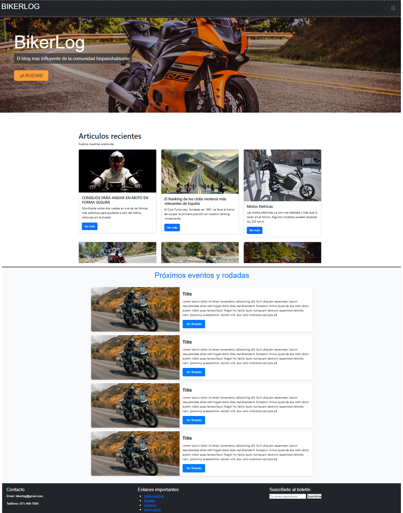
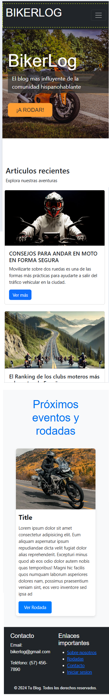

# BIKERLOG 🏷️

## Descripción 📜
BIKERLOG es una plataforma diseñada para conectar a motociclistas apasionados, donde pueden compartir experiencias, rutas y su amor por la aventura sobre dos ruedas. La comunidad se centra en inspirar y apoyar a todos los entusiastas del motociclismo, ofreciendo un espacio para planificar rodadas, intercambiar consejos y disfrutar de la cultura biker.

## Mockups 🎨📐

<br>
<br>
## Version movil

 

## Tecnologías Usadas 💻⚙️
- **HTML**: Para la estructura del contenido.
- **CSS**: Para el diseño visual, la estética y responsivo.
- **Bootstrap**: Para la creación de un diseño responsivo y componentes predefinidos.

## Autores 👥🔧
- **Jesus Mora**: Scrum Master
- **Alvaro Gil** : Developer

## Cómo Empezar 🚀
Para clonar el repositorio y comenzar a trabajar en el proyecto, utiliza el siguiente comando:

```bash
git clone https://github.com/tu_usuario/bikerlog.git
